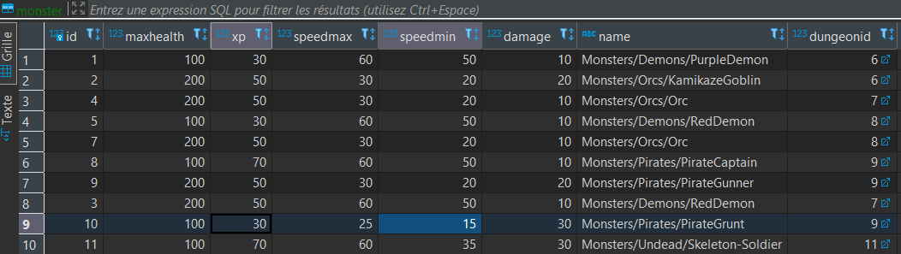
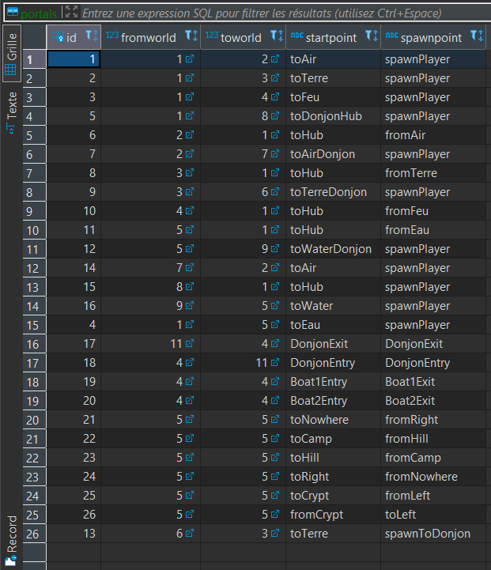

# Projet 2

- [Presentation](#presentation)
- [Installation](#installation)
- [Technical Description](#technical-description)
- [Contributor](#contributor)

## Presentation

This game is a simple pygame project. It's a RPG like game where you can fight with monsters and clear dungeon to save the world.

## Installation

- [Download Python 3.9 or newer](https://www.python.org/downloads/)
- Create a virtual environment with the command: `py -m venv my_env`
- Activate the virtual environment with the command: `my_env/Scripts/activate`
- Install the dependencies with the command: `pip install -r requirements.txt`
- Launch the game with the command: `python main.py`

## Technical Description

### Maps

The game is built with a map system. The map is composed of a grid of tiles. Each tile is a square of size 32x32 pixels. Maps are build using Tiled, and the path leading to the tileset is specified in the database.

Each map need to specify either or not it is a dungeon.

*Specification* in order to create a new map:

- In the database :
  - `name` : The name of the map : `path/to/map` from the `assets` folder
  - `isDungeon` : Specify if the map is a dungeon or not
  - `spawnName` : the name of the spawn point for the monster if the map is a dungeon

- File
  - Place the file in the `assets` folder, with a folder name relevant to the map

 

### Dungeons

If the world is a dungeon, you must indicate a `spawname` in the `world` table : it's the place where the monsters will spawn in dungeon. Speaking of which, you must specify the monsters you want to create.

- Specification
  - `maxhealth` : The health points of the monster
  - `xp` : The experience points of the monster
  - `speedmax` : The max speed points of the monster (set the same speed for min and max if you want a specific speed)
  - `speedmin` : The min speed points of the monster (set the same speed for min and max if you want a specific speed)
  - `damage` : The attack points of the monster
  - `name` : The path of the monster from the `assets` folder

### Portals

When you create a new world, you might want to create a portal to another world. You can do it by creating a portal in the database.

*Specifity*:

- `fromworld` : a foreign key to the world where the portal is
- `toworld` : a foreign key to the world where the portal leads to
- `startpoint` : the name of the start point of the portal
- `spawnpoint` : the name of point where the player will spawn after the portal
